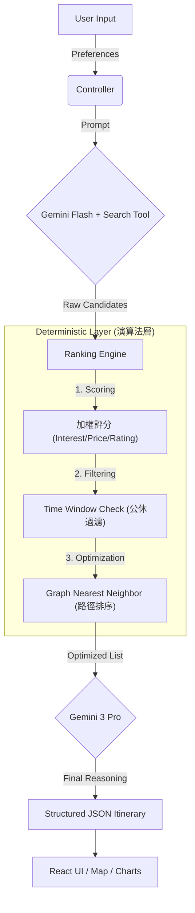

# ✈️ AI TravelGenius (AI 智能旅程規劃師)

   

> **"不再為繁瑣的行程規劃頭痛。讓 AI 與演算法為您打造完美的旅行體驗。"**

AI TravelGenius 是一個基於 **Google Gemini API** 的現代化 Web 應用程式。它不僅僅是一個 AI 聊天機器人，而是一個結合了 **LLM (大型語言模型)** 與 **傳統演算法 (Graph Search)** 的混合型系統，旨在解決旅遊規劃中「資訊過載」與「路線優化」的痛點。

---

## 🌟 核心功能 (Key Features)

*   **智能行程生成**：根據用戶的預算、旅行節奏（休閒/特種兵）、興趣偏好（美食/購物/文化），自動生成每日行程。
*   **多地點住宿支援**：支援跨城市旅遊，自動處理多間酒店的日期銜接與交通考量。
*   **即時預算估算**：整合多國貨幣匯率，自動計算門票、餐飲與交通成本。
*   **視覺化地圖與圖表**：整合 Leaflet 地圖展示每日路線，並使用 Recharts 分析每日預算結構。
*   **雲端保存與分享**：整合 Firebase Firestore，允許用戶保存行程並生成分享連結。
*   **KML 匯出**：支援匯出標準 KML 格式，可直接匯入 Google My Maps 進行導航。

---

## 🔧 技術亮點 (Technical Highlights) - *CV 重點*

本專案展示了如何解決 LLM 幻覺與邏輯缺陷的問題，透過 **RAG (檢索增強生成)** 的變體與 **確定性演算法** 來提升規劃品質。

### 1. 混合模型架構 (Hybrid AI Architecture)
為了平衡成本、速度與推理能力，本系統採用了兩階段模型策略：
*   **Stage 1 (Candidate Generation)**: 使用輕量級的 **Gemini 2.5 Flash** 配合 `Google Search Tool`。利用其低延遲特性，快速從網路上檢索大量最新的景點資訊（包含評分、價格、最新營業時間）。
*   **Stage 3 (Final Planning)**: 使用推理能力較強的 **Gemini 3 Pro**。將經過演算法優化後的結構化數據餵給模型，專注於生成詳細的推薦理由與合理的預算分配。

### 2. 圖論路徑優化 (Graph-based Route Optimization)
單純依賴 LLM 安排景點順序往往會導致「東奔西跑」的不合理路線。本專案實作了 **Traveling Salesperson Problem (TSP)** 的變體演算法：
*   **資料結構**：將景點視為 Graph 中的 Node，景點間的物理距離 (Haversine Formula) 視為 Edge Weight。
*   **演算法**：實作 **貪婪最近鄰 (Greedy Nearest Neighbor)** 演算法。系統會從酒店出發，尋找權重最小（距離最近）的下一個未訪問節點，形成一條總移動成本最低的「貪吃蛇」路徑。

### 3. 時間窗口約束 (Time Window Constraints via Dictionary)
為了解決「到了景點才發現公休」的問題，系統引入了時間感知機制：
*   **資料結構**：使用 Dictionary (Hash Map) 結構 `closedDays: number[]` 儲存每個景點的閉館日。
*   **邏輯**：在路徑規劃演算法中加入時間維度。當演算法規劃「第 N 天」的行程時，會先以 O(1) 複雜度查詢並過濾掉當天公休的候選點，再進行路徑搜尋，確保生成的行程在時間上絕對可行。

### 4. 結構化 Prompt Engineering
為了確保 LLM 輸出的穩定性，設計了嚴格的 JSON Schema Prompt，並實作了容錯解析器 (Robust JSON Parser)，能處理 Markdown 代碼塊殘留與非標準 JSON 格式，大幅降低 API 錯誤率。

---

## 🏗️ 系統架構 (System Architecture)



---

## 💻 技術棧 (Tech Stack)

*   **Frontend**: React 19, TypeScript, Vite
*   **Styling**: Tailwind CSS (Responsive Design, Dark Mode)
*   **AI/LLM**: Google GenAI SDK (Gemini 2.5 Flash & 3.0 Pro)
*   **Maps**: Leaflet, React-Leaflet
*   **Visualization**: Recharts
*   **Backend/Storage**: Firebase (Firestore) for persistence, LocalStorage for offline fallback
*   **Utils**: jsPDF (Print), Lucide React (Icons)

---

## 🚀 如何執行 (Getting Started)

1.  **Clone 專案**
    ```bash
    git clone https://github.com/your-username/ai-travel-genius.git
    cd ai-travel-genius
    ```

2.  **安裝依賴**
    ```bash
    npm install
    ```

3.  **設定環境變數**
    請在根目錄建立 `.env` 檔案，並填入您的 API Keys：
    ```env
    VITE_API_KEY=your_google_gemini_api_key
    
    # Firebase Config (Optional - Fallback to LocalStorage if missing)
    VITE_FIREBASE_API_KEY=...
    VITE_FIREBASE_PROJECT_ID=...
    # ... other firebase configs
    ```

4.  **啟動開發伺服器**
    ```bash
    npm run dev
    ```

---

## 📈 未來展望 (Future Roadmap)

*   [ ] **使用者回饋迴圈**：允許使用者拖路徑調整順序，並即時重新計算交通時間。
*   [ ] **多模態輸入**：允許使用者上傳機票或飯店確認信截圖 (Gemini Vision)，自動解析並填入表單。
*   [ ] **即時交通 API**：整合 Google Routes API 以獲取即時的大眾運輸班次資訊 (目前使用估算值)。

---

*Created by [Your Name]*
